# ET AI Concierge

ET AI Concierge is a full-stack web app that personalizes Economic Times product discovery.
It analyzes user interactions, adapts persona/state in real time, and recommends next-best actions across ET products.

## What This Project Does

1. Onboards a user through a short concierge flow.
2. Builds a behavioral profile (digital twin) and persona.
3. Tracks actions like click, read, ignore, convert.
4. Uses a bandit-based ranking engine to score ET products.
5. Returns dynamic recommendations and next-best actions to the UI.
6. Supports voice input and voice-persona inference endpoints.

## Architecture / Flow Diagram


## Repository Structure

1. `backend/`: FastAPI app, recommendation engine, profile state logic, voice/AI endpoints.
2. `frontend/`: Next.js app with dashboard, marketplace, intelligence pages, and onboarding UX.
3. `scripts/`: Root-level helper scripts to start backend quickly.

## Backend Code Map

1. `backend/app/main.py`: FastAPI app creation, CORS config, router mounting.
2. `backend/app/api/chat.py`: Chat endpoint and intent-driven state updates.
3. `backend/app/api/profile.py`: Profile initialization and recomputation logic.
4. `backend/app/api/recommendations.py`: Recommendation endpoints.
5. `backend/app/api/tracking.py`: Event tracking endpoint.
6. `backend/app/api/ai.py`: Voice chat endpoint and HF+RL blending.
7. `backend/app/rl_engine/bandit.py`: Multi-armed bandit scoring and event memory.
8. `backend/app/rl_engine/intelligence_engine.py`: Next-action prediction, persona adaptation, digital twin.
9. `backend/app/services/hf_service.py`: Persona/product signal generation with fallback logic.
10. `backend/app/services/voice_service.py`: Voice response payload shaping.

## Frontend Code Map

1. `frontend/src/app/page.tsx`: Main concierge/chat experience.
2. `frontend/src/app/dashboard/page.tsx`: Personalized dashboard UI.
3. `frontend/src/app/marketplace/page.tsx`: Product discovery marketplace.
4. `frontend/src/app/intelligence/page.tsx`: Intelligence analytics view.
5. `frontend/src/context/DashboardContext.tsx`: Shared state, polling, tracking actions.
6. `frontend/src/components/WelcomeConcierge.tsx`: Onboarding and persona seed selection.
7. `frontend/src/components/VoiceButton.tsx` and `frontend/src/hooks/useVoice.ts`: Browser speech input flow.

## Tech Stack

1. Frontend: Next.js 16, React 19, TypeScript, Tailwind v4, Framer Motion.
2. Backend: FastAPI, Pydantic, Uvicorn.
3. Intelligence: RL bandit ranking plus lightweight HF-based scoring/fallback.

## Prerequisites (Any Computer)

1. Git 2.40+
2. Python 3.10+
3. Node.js 20+ and npm

## Fork And Run Locally

### 1) Fork on GitHub

1. Open this repo on GitHub.
2. Click `Fork`.
3. Fork to your own account.

### 2) Clone Your Fork

```bash
git clone https://github.com/<your-username>/ET-AI-Concierge.git
cd ET-AI-Concierge
```

Optional: keep original repo as upstream.

```bash
git remote add upstream https://github.com/MD-IRFAN-RAJ/ET-AI-Concierge.git
```

### 3) Backend Setup

From repository root:

Windows PowerShell:

```powershell
python -m venv .venv
.\.venv\Scripts\Activate.ps1
pip install --upgrade pip
pip install -r backend/requirements.txt
Copy-Item backend/.env.example backend/.env
```

macOS/Linux:

```bash
python3 -m venv .venv
source .venv/bin/activate
pip install --upgrade pip
pip install -r backend/requirements.txt
cp backend/.env.example backend/.env
```

Run backend:

Windows:

```powershell
powershell -ExecutionPolicy Bypass -File backend/start-backend.ps1 -Port 8000
```

macOS/Linux:

```bash
uvicorn app.main:app --app-dir backend --reload --host 127.0.0.1 --port 8000
```

Health check:

```bash
curl http://127.0.0.1:8000/api/v1/health
```

### 4) Frontend Setup

Open another terminal:

```bash
cd frontend
npm install
```

Create env file:

Windows PowerShell:

```powershell
Copy-Item .env.example .env.local
```

macOS/Linux:

```bash
cp .env.example .env.local
```

Start frontend:

```bash
npm run dev
```

Open: `http://localhost:3000`

## Environment Variables

1. Backend: `backend/.env`
2. Frontend: `frontend/.env.local`

Backend variables:

1. `CORS_ALLOWED_ORIGINS`: comma-separated origins.

Frontend variables:

1. `BACKEND_API_BASE_URL`: backend base URL.
2. `ALLOWED_DEV_ORIGINS`: comma-separated dev origins for Next config.

## Common Commands

```bash
# frontend
cd frontend
npm run dev
npm run build
npm run lint

# backend (from repo root with venv active)
uvicorn app.main:app --app-dir backend --reload --host 127.0.0.1 --port 8000
```

## Troubleshooting

1. `CORS` errors: ensure `backend/.env` has your frontend origin in `CORS_ALLOWED_ORIGINS`.
2. `API not reachable from frontend`: verify `frontend/.env.local` points to correct backend URL.
3. `Speech features not working`: supported browsers are required for Web Speech APIs.
4. `Module not found` in backend: activate venv and reinstall `backend/requirements.txt`.
5. First AI run is slow: `transformers` and `sentence-transformers` models may warm up on first request.

## API Base Routes

1. `GET /api/v1/health`
2. `POST /api/v1/chat/`
3. `GET /api/v1/profile/{user_id}`
4. `POST /api/v1/profile/{user_id}/initialize`
5. `POST /api/v1/track/`
6. `POST /api/v1/ai/voice-chat`


## Architecture & Flow

High-level architecture and user flow for the ET AI Concierge application.

```mermaid
flowchart LR
	U[User Browser] -->|Interact / Voice| F[Frontend (Next.js)]
	F -->|REST / WebSocket| B[Backend (FastAPI)]
	B --> R[RL Bandit Engine (`rl_engine`)]
	B --> M[HF Models & AI Services]
	B --> S[Event Memory / Store]
	R --> B
	M --> B
	S --> R
	click F "#" "Frontend serves UI, captures events"
```

- **Frontend (Next.js)**: Handles onboarding, voice input, dashboard, marketplace and intelligence UI. Calls backend APIs via `BACKEND_API_BASE_URL`.
- **Backend (FastAPI)**: Serves AI/chat endpoints, profile initialization, tracking, and the bandit-based ranking engine.
- **Intelligence layer**: `rl_engine` computes scores and recommends next-best actions; online signals are stored in lightweight in-memory event memory.

User flow:
1. User opens frontend and completes concierge onboarding.
2. Frontend posts user actions to `POST /api/v1/track/` and requests recommendations from `POST /api/v1/recommendations`.
3. Backend updates profile and uses the bandit engine to return personalized items.
4. Frontend renders recommendations and logs conversions back to backend.

Screenshots (local):

<!-- Gallery: copied screenshots are in docs/screenshots -->

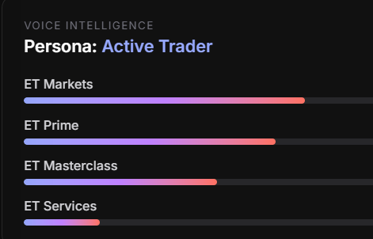
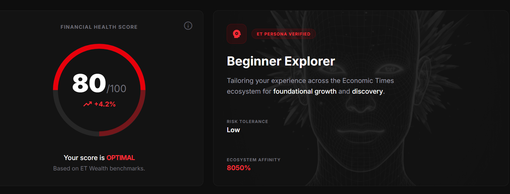
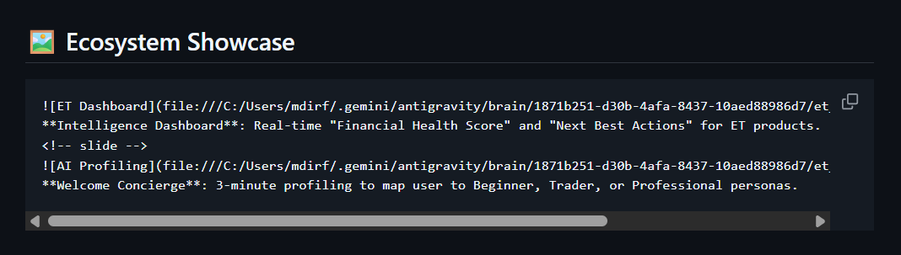
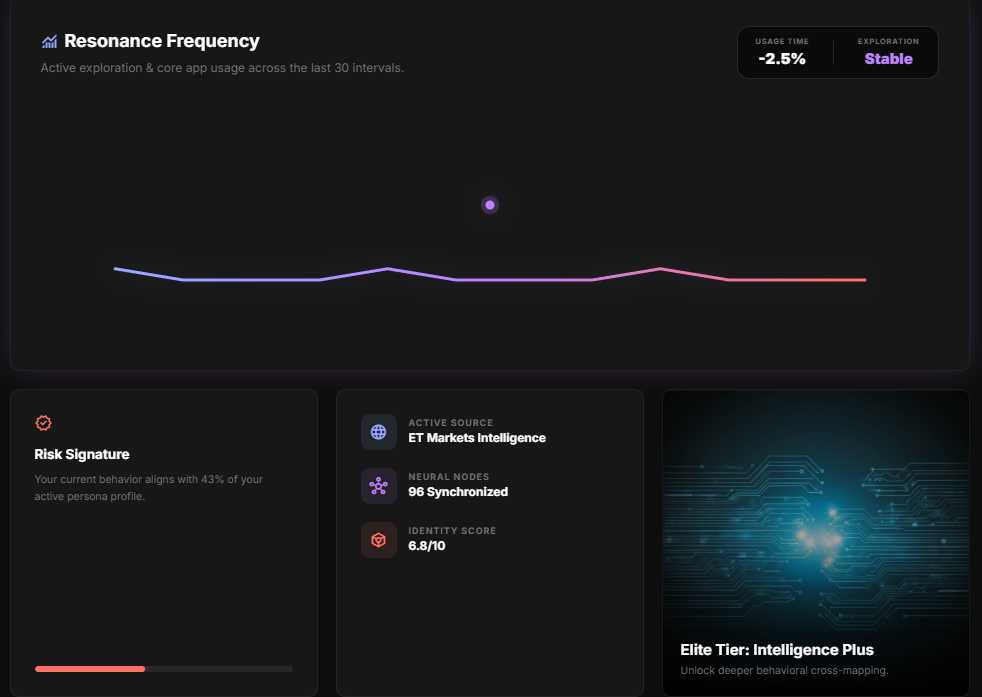
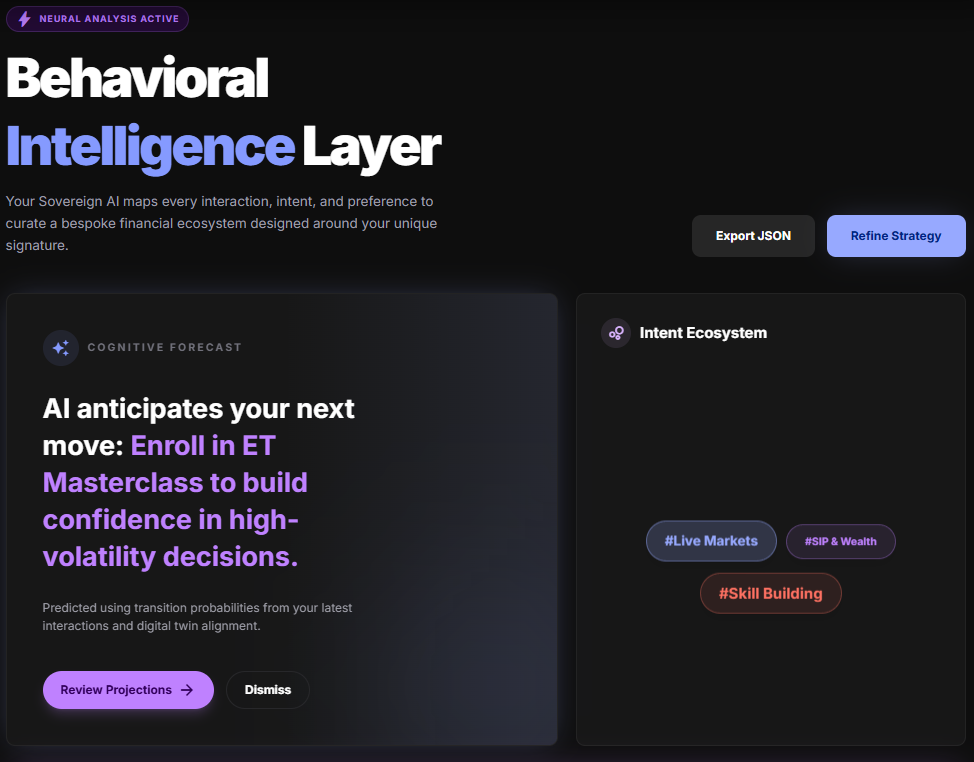
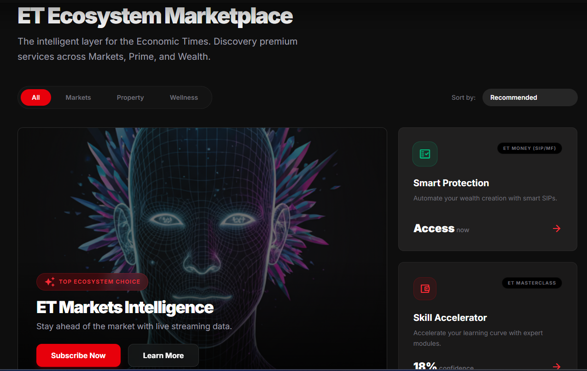
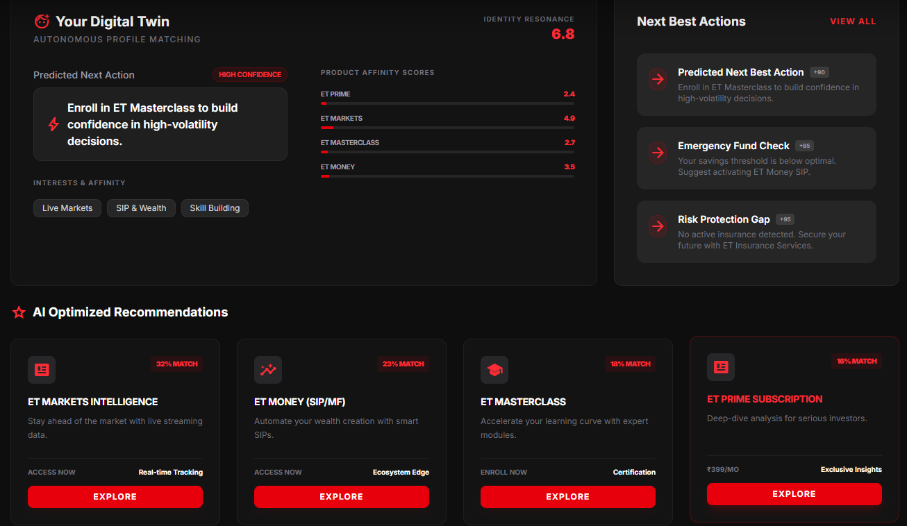
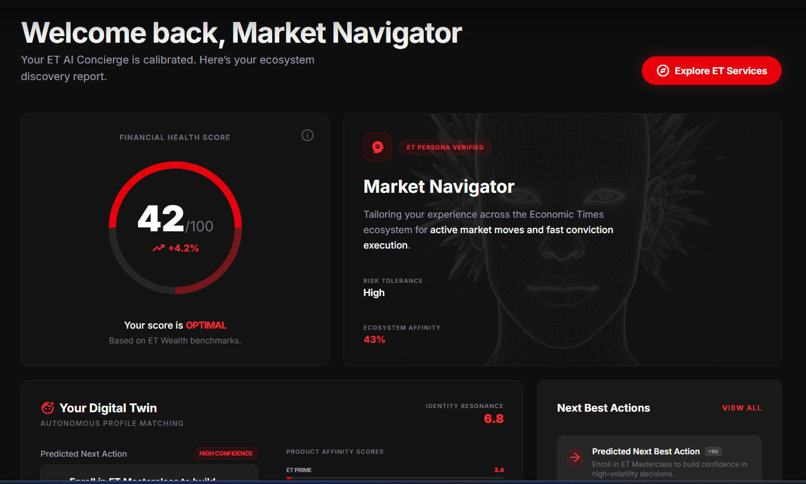
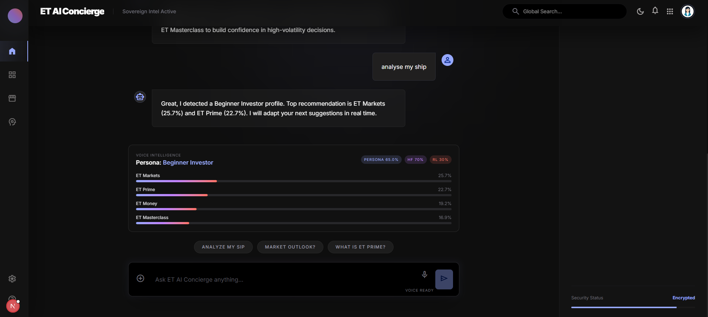
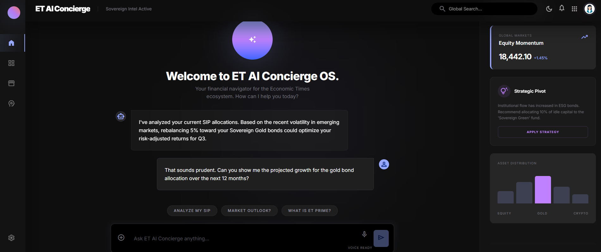
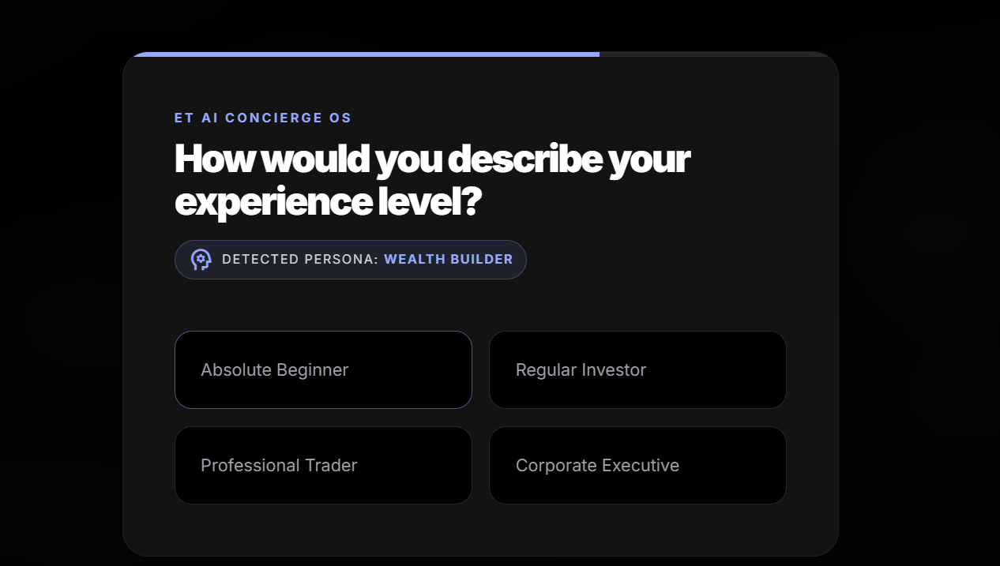

