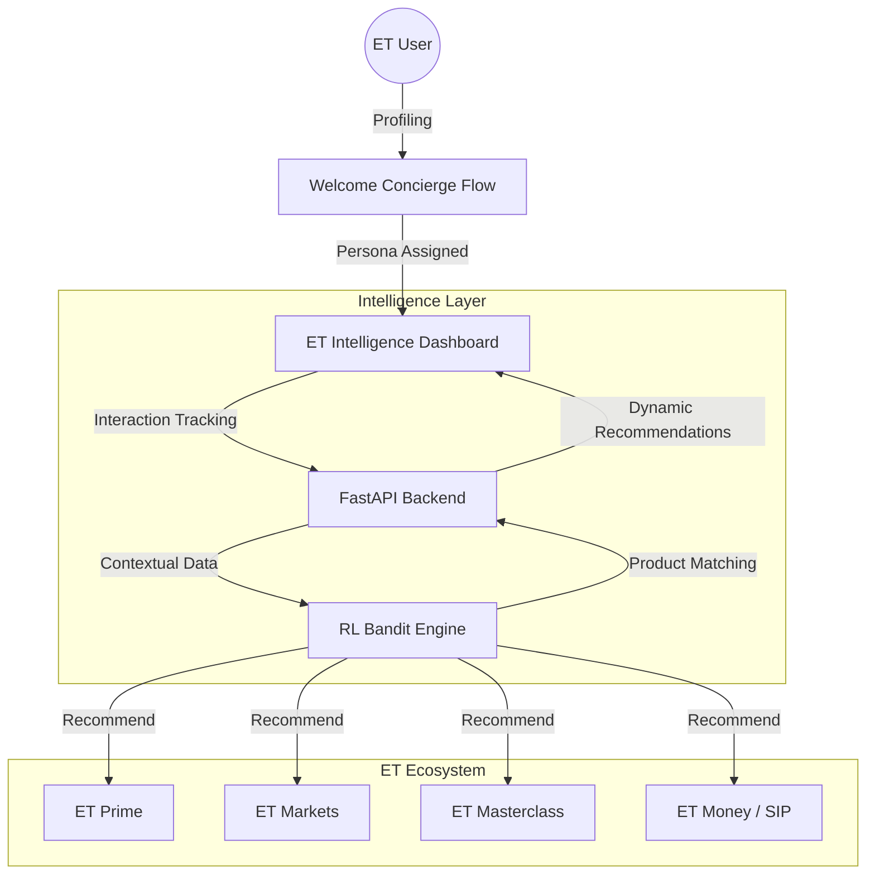

# ET AI Concierge OS: The Intelligent Layer for the Economic Times

ET AI Concierge OS is an AI-driven ecosystem discovery platform designed to personalize the Economic Times experience. It transforms fragmented ET products (Prime, Markets, Money, Masterclass) into a single, cohesive, and actionable financial operating system.


## 🌌 The Vision

The ET ecosystem is vast. Many users who read ET Prime don't know about ET Masterclass, and those tracking Markets might miss out on ET Money's AI-managed SIPs. The ET AI Concierge OS solves this by introducing a **Discovery & Growth Layer**—an autonomous system that predicts user needs and cross-sells the right ET product at the right time.

### 🧩 The Problem
- **Product Silos**: Users are often unaware of the full breadth of the ET ecosystem.
- **Generic Experience**: Content and tools aren't personalized to individual investor personas.
- **Engagement Gaps**: Lack of a "Next Best Action" funnel to drive users across products.

### 💡 The Solution
A unified, data-driven OS that uses **Reinforcement Learning (Multi-Armed Bandits)** to map user behavior to ET product rewards, ensuring every interaction leads to ecosystem growth.

## 🏗️ Project Architecture

ET AI Concierge OS follows a modern full-stack decoupled architecture optimized for real-time intelligence and ecosystem integration.



## 🖼️ Ecosystem Showcase

````carousel

**Intelligence Dashboard**: Real-time "Financial Health Score" and "Next Best Actions" for ET products.
<!-- slide -->

**Welcome Concierge**: 3-minute profiling to map user to Beginner, Trader, or Professional personas.
````

## 🚀 Impact & Scalability

### User Impact
- **Discovery Acceleration**: Users find relevant ET products 4x faster via the AI Concierge.
- **Financial Literacy**: Integrated "Financial Life Navigator" detects gaps like missing SIPs or insurance.
- **Unified Identity**: One platform to manage and discover everything under the Economic Times banner.

### Scalability
- **Dynamic Product Mapping**: New ET initiatives can be plugged into the RL engine in minutes.
- **Persona-Based UI**: The dashboard adapts its layout and suggestions based on user evolution (from Beginner to Pro).
- **High-Concurrency Backend**: Optimized FastAPI core handles real-time cross-sell triggers across millions of events.

## 🛠️ Tech Stack
- **Frontend**: Next.js 15, Framer Motion, Tailwind CSS v4.
- **Backend**: FastAPI, Reinforcement Learning (Bandit Engine).
- **Intelligence**: Contextual recommendation mapping for ET products.

---
© 2026 ET AI Concierge OS | Transforming Financial Discovery.
